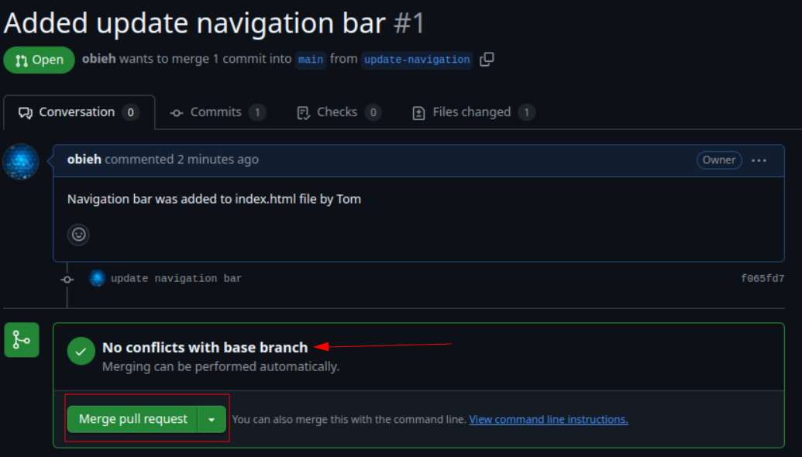

# AIStartupWebsite
## This Project Demonstrates How to Create a Pull Request and Merge Branches To Main Branch

### Create a pull request for Tom's contribution.

  **1. Navigate to your Git repository click the branch menu**

 **2. Select and switch to the update-navigation branch**

  

  **3. Create *New Pull Request*:**

  * Click on *contribute* and select *Open pull request* on the drop down menu

   

### Before creating a pull request be sure to review the difference from the main branch and ascertain everything is okay!

**4. Review changes made by Tom**

**5. Create the Pull request**

* If all is well then click **"Create pull request"**.
* Add title and description to march the changes made. Then create the pull request.

### Merge Tom's pull request to branch
* After creating the pull request and there is no conflick with the base branch. Click on _'merge pull request'_ to merge.

* Lastly, to click on _confirm merge_ to finally merge Tom's work with main.

* If the merge is succesfull, git confirm by displaying the window below

## Create a pull request for Jerry's contribution.

**1. Navigate to your Git repository click the branch menu**

 **2. Select and switch to the add-contact-info branch**

 

**3. Create *New Pull Request*:** For Jerry's branch add-contact-info

  * Click on *contribute* and select *Open pull request* on the drop down menu

  

### Before creating a pull request for Jerry's contribution be sure to review the difference from the main branch and ascertain everything is okay!

**4. Review changes made by Jerry**

**5. Create the Pull request for jerry's contribution**

* After creating the pull request and there is no conflick with the base branch. Click on _'merge pull request'_ to merge Jerry's pull request.

* Lastly, to click on _confirm merge_ to finally merge Jerry's work with main.

* If the merge is succesfull, git confirm by displaying the window below

